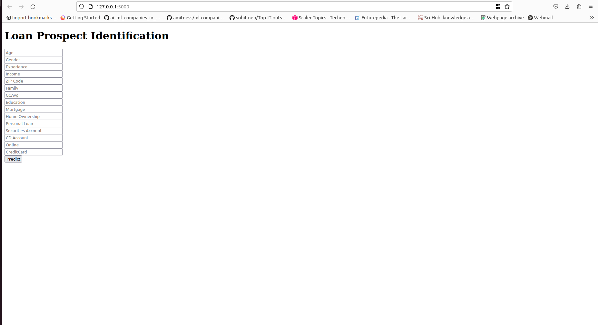
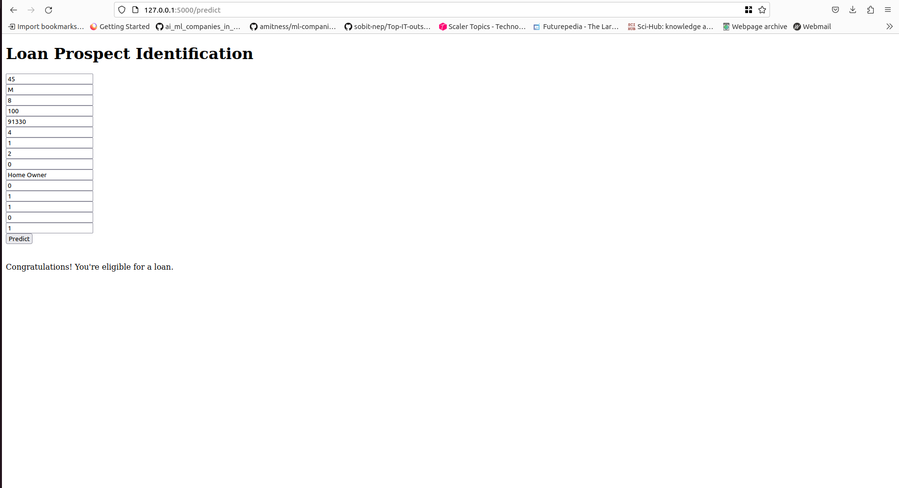

# LoanProspectClassifier

The high-level task at hand is to provide personal loans to people efficiently and responsibly. This includes identifying the right individuals to approach and offering them suitable loan offers. By accurately classifying loan applicants, we aim to maximize loan approval for eligible people.

A bank loan dataset is used consisting of 5000 rows and 16 columns including the target column. The technical task is to classify whether the personal loan was accepted or not based on the information provided.

